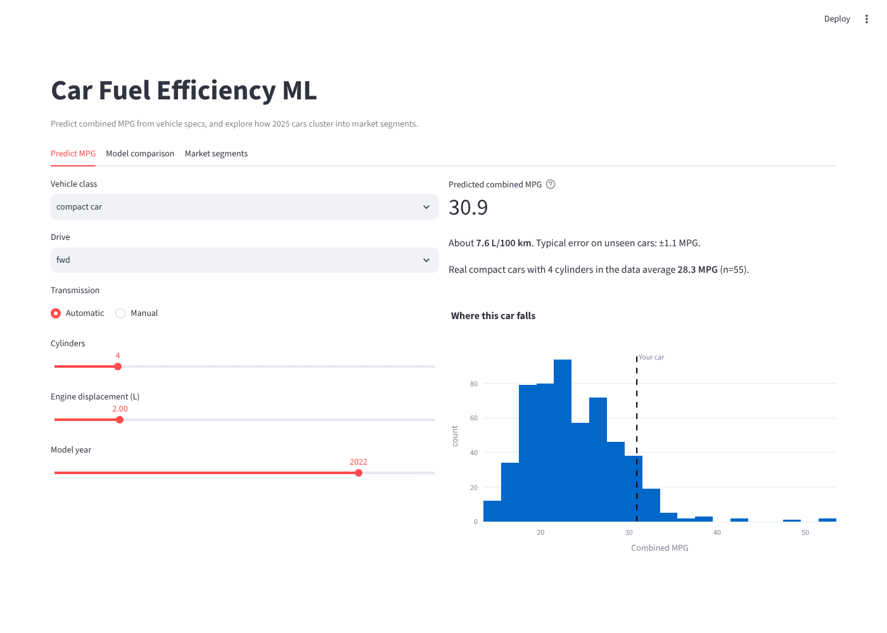

# Car Fuel Efficiency ML

Predict a car's **real, measured fuel economy** from its specs, and group 1,200 car models from 2025 into **market segments** with K-Means. Everything runs in an interactive Streamlit web app.

**Live demo:** [https://fuel-efficiency-predictor-ynkadaad3zmwgyycbksavk.streamlit.app/]([url](https://fuel-efficiency-predictor-ynkadaad3zmwgyycbksavk.streamlit.app/))



## Results

| Model | CV MAE (MPG) | Test MAE | Test RMSE | Test R² |
|---|---|---|---|---|
| Linear Regression | 1.94 | 1.91 | 2.51 | 0.74 |
| Random Forest | 1.60 | 1.31 | 1.92 | 0.85 |
| **XGBoost** | **1.58** | **1.07** | **1.65** | **0.89** |

- The baseline of guessing the average MPG for every car gives an MAE of **4.16 MPG**. XGBoost cuts that error by about **74%**.
- **XGBoost is *not* significantly better than Random Forest.** A paired t-test across the same 10 cross-validation folds gives p = 0.83. On data this size, the two tree models are effectively tied.
- **K-Means found 5 segments** among 2025 models, with k chosen by silhouette score: Everyday (424 models), Premium (552), Sports & Luxury (210), Hypercar (11) and Heavy-duty trucks (8).

## What I changed from version 1 (and why)

The first version of this project ([`notebooks/v1_original_simulated_target.ipynb`](notebooks/v1_original_simulated_target.ipynb)) used the Kaggle *Cars Datasets 2025* file. That file has no fuel consumption column, so v1 **simulated** one with a formula (`City L/100km = CC/500 + HP/100 + noise`). The models scored R² ≈ 0.96, but they were only learning back the formula I had written. They weren't learning anything about real cars.

Version 2 fixes this:

1. **Regression uses measured MPG.** `data/car_data.csv` has 550 vehicles (model years 2014–2024) with real city, highway and combined MPG. The lower R² (0.89) is an honest number.
2. **The 2025 dataset is still used where it fits.** Clustering needs no target variable, so K-Means market segmentation runs on the real 2025 specs.
3. **Data quality rules were added after EDA:**
   - GMC Hummer EV and Tesla Roadster list "wheel torque" (15,590 and 10,000 Nm), a marketing figure about 10× engine torque, so those rows are removed.
   - A Nissan Urvan listed at 2,488 hp is an entry error and is removed.
   - Prices span $10k–$3M+, so price is log-transformed before clustering.
   - Electric vehicles are removed from the MPG model, since MPG isn't meaningful for them.
4. **Models are compared with a significance test** instead of being picked by raw score alone.

## How it works

```
data/car_data.csv ──► src/train.py ──► models/model.joblib ──┐
   (measured MPG)     CV + paired t-test                      ├──► app.py (Streamlit)
data/cars_2025.csv ─► src/segment.py ─► cars_2025_segments ──┘
   (2025 specs)       K-Means + silhouette
```

- **Features:** cylinders, displacement and model year (scaled), plus vehicle class, drive type and transmission (one-hot encoded).
- **Pipeline:** a scikit-learn `ColumnTransformer` + model in a single `Pipeline`, so the app applies exactly the same preprocessing as training did.

## Run it locally

```bash
pip install -r requirements.txt
python -m src.train      # trains models, prints the comparison
python -m src.segment    # builds the market segments
streamlit run app.py     # opens the web app
pytest                   # runs the tests
```

## Deploy (free)

1. Push this repo to GitHub.
2. Go to [share.streamlit.io](https://share.streamlit.io), click **New app**, pick this repo and set the main file to `app.py`.
3. The model trains automatically on first launch.

## Tech

Python · pandas · scikit-learn · XGBoost · SciPy · Plotly · Streamlit · pytest

## Data sources

- `car_data.csv`: car fuel economy data (city, highway and combined MPG) for 2014–2024 vehicles, from Kaggle (add the dataset link here).
- `cars_2025.csv`: *Cars Datasets 2025*, from Kaggle (add the dataset link here).
